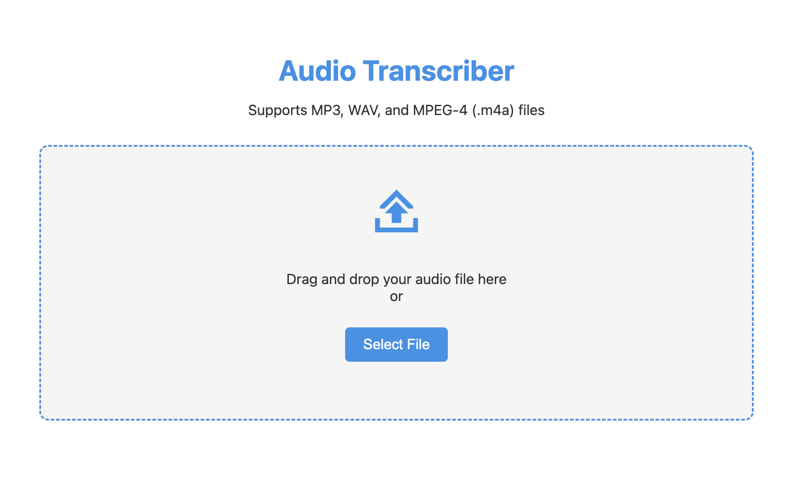

# Audio Transcriber

An Electron-based desktop application for transcribing audio files using OpenAI's Whisper API.

## Features

- Support for MP3, WAV, and MPEG-4 (.m4a) audio files
- Drag and drop interface
- Automatic audio compression and optimization
- Handles large files by splitting into chunks
- Progress tracking with time estimates
- Export transcriptions to text files
- Copy to clipboard functionality



## Prerequisites

- Node.js and npm
- ffmpeg (for audio processing)
- OpenAI API key

## Setup

1. Clone the repository
```bash
git clone https://github.com/PacomeLeRouge/audio-transcriber.git
cd audio-transcriber
```

2. Install dependencies
```bash
npm install
```

3. Create a `.env` file in the root directory and add your OpenAI API key:
```
OPENAI_API_KEY=your_api_key_here
```

4. Start the application
```bash
npm start
```

## Usage

1. Launch the application
2. Drop an audio file or click "Select File"
3. Wait for the transcription to complete
4. Use the copy or download buttons to save the transcription

## Technical Details

- Uses Electron for the desktop interface
- Implements ffmpeg for audio processing
- Integrates with OpenAI's Whisper API for transcription
- Handles files larger than 25MB by splitting into chunks
- Converts audio to optimal format (16kHz mono WAV)

## License

This project is licensed under the MIT License - see the [LICENSE](LICENSE) file for details.

### Third-party Licenses

This software uses the following open source packages:
- [Electron](https://github.com/electron/electron) - MIT License
- [fluent-ffmpeg](https://github.com/fluent-ffmpeg/node-fluent-ffmpeg) - MIT License
- [OpenAI Node API](https://github.com/openai/openai-node) - Apche 2.0 License

The transcription feature uses the OpenAI Whisper API, which requires a valid API key and is subject to OpenAI's terms of service.
